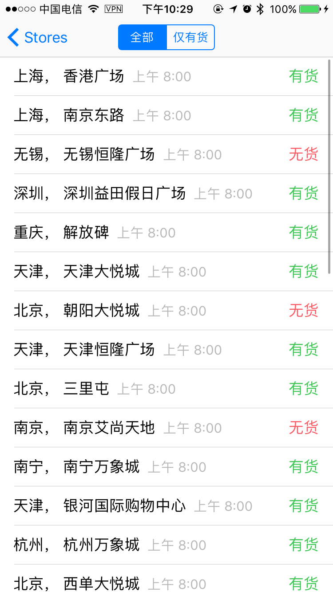

# Reserva
Check iPhone 7 &amp; 7+ stock availability directly on your iPhone. 

Currently support HK PRC and Mainland China, but your can easily expand it to other regions. Just replace with region only models and URLs. 

This project is a simple tool to check for iPhone 7 & 7 Plus stock availability using Apple's JSON API. I will not garantee the stability of this method. Use it at your own risks. Both work under iPad or iPhone. 

Please use [sideload](https://www.igeeksblog.com/how-to-sideload-apps-on-iphone-and-ipad/) method to install it on your devices. 

Anyway, just 2.5 hrs of work, enjoy!
